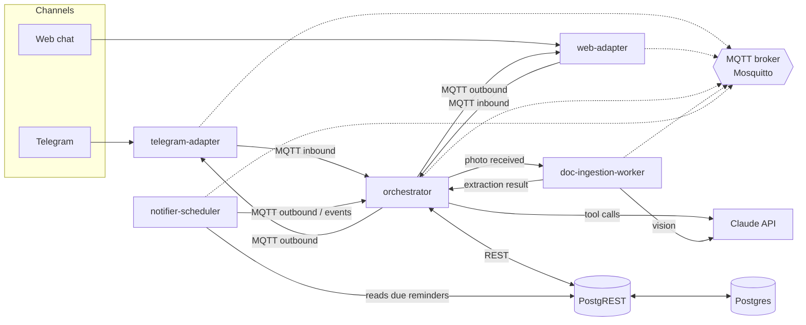

# 🏠 Home Assistant on Barbara

A conversational home assistant that lives on a [Barbara](https://barbara.tech) edge node. You talk to it over Telegram (or a plain web chat), and it helps you catalog your home devices, troubleshoot them, learn about stuff, and figure out what to buy next.

This started as a personal project, but it's built on Barbara — an industrial edge computing platform — on purpose: the same patterns here (event bus, JSONB-first schema, ISA95-style location hierarchy) are meant to scale later into an industrial knowledge-base use case (PLCs, SCADA, Historians). None of that industrial stuff is built yet — it's just why some design choices look a little more "enterprise" than a home project strictly needs.

[](./LICENSE)


---

## What it does

Talk to it like you'd talk to a knowledgeable housemate:

- **Add a device** — snap a photo of a label or manual, it extracts brand/model/specs via Claude vision, shows you a draft, you confirm, done.
- **Troubleshoot** — ask about anything you've added ("why won't the washing machine drain?"), it uses the device's saved specs plus a web search if needed, and walks you through a fix step by step.
- **Learn something** — ask for a quick course on any topic, get a short lesson plus a quiz to check you actually absorbed it.
- **Shop smart** — ask what to buy next (or what to replace something with), and it recommends options that are compatible with what you already have, with real prices/popularity pulled from the web.
- **Reminders** — maintenance nudges, price drops, firmware updates — delivered back through whichever channel you're on.

No canned menus, no keyword commands. Every "what does the user actually want" decision is delegated to Claude with structured output — see [Design notes](#design-notes) below.

## Architecture



Everything talks to everything else over **MQTT** — no service calls another service's API directly. Channel adapters (Telegram, web) are dumb translators: they turn whatever the channel gives them into a normalized message and publish it, and turn outbound normalized messages back into channel-native replies. The `orchestrator` never knows or cares which channel a message came from — that's the whole point of the adapter pattern, and it's what makes adding a new channel (WhatsApp, Slack, voice, whatever) a matter of writing one more adapter, not touching the brain.

## Services

| Service | What it does | Notes |
|---|---|---|
| [`telegram-adapter`](./telegram-adapter) | Telegram ↔ normalized message | `aiogram` v3, long polling — no port exposed, no webhook/TLS to manage |
| [`web-adapter`](./web-adapter) | Minimal web chat ↔ normalized message | Always-on fallback channel — no Telegram account needed. The only service with an exposed port (8090) |
| [`orchestrator`](./orchestrator) | The brain: routes by channel/intent, runs all 4 flows | Stateless — conversation state lives in Postgres, not in the process, so it can scale to replicas |
| [`doc-ingestion-worker`](./doc-ingestion-worker) | Extracts device data from a photo via Claude vision | Own queue, bounded concurrency — never blocks the normal chat flow |
| [`notifier-scheduler`](./notifier-scheduler) | Checks due reminders, publishes alerts | `APScheduler` with a Postgres-backed jobstore, survives restarts |
| [`shared`](./shared) | Common library: message contract, MQTT/PostgREST clients, config/logging, structured Claude calls | Not a deployable service — a workspace package the others depend on |

## External services (not part of this repo)

Reused from Barbara's Marketplace instead of reimplemented — see the [Design notes](#design-notes):

| Service | Used for | Where it comes from |
|---|---|---|
| **Mosquitto** (MQTT broker) | The event bus every service talks over | Barbara Marketplace connector |
| **PostgreSQL** | All persistent data (devices, conversations, reminders) | Barbara Marketplace connector |
| **PostgREST** | Turns the Postgres schema into a REST API — no custom CRUD service | Barbara Marketplace connector |
| **Anthropic Claude API** | All the "smart" parts: intent, vision extraction, troubleshooting, course generation, web search | External API — you need your own key |
| **Telegram Bot API** | The Telegram channel | External API — you need your own bot token |

## Repo layout

Monorepo, `uv` workspace. One Python package per service, plus `shared`:

```
.
├── shared/                 # common library (all services depend on this)
├── telegram-adapter/
├── web-adapter/
├── orchestrator/
├── doc-ingestion-worker/
├── notifier-scheduler/
├── db/schema.sql           # Postgres DDL (schema `home`, served by PostgREST)
├── docker-compose.yml      # for the Barbara edge node — no secrets/appconfig here, the platform injects them
├── docker-compose-local.yml # for local debugging — same services, but with env_file/volumes so it runs standalone
├── Dockerfile.service      # one generic Dockerfile for all 5 services, parameterized via build args
└── pyproject.toml          # workspace root
```

Each service has its own `README.md` (linked in the table above) with its specific config, required secrets, and how to get credentials for whatever external API it needs.

## Running it locally

You don't need a Barbara node to try this out — `docker-compose-local.yml` runs everything standalone, including a jobstore-only Postgres reachable at `postgresql`. You still need your **own** MQTT broker, Postgres+PostgREST, and API keys, since those aren't bundled (see the table above and each service's README for exact credentials).

1. **Get the external pieces running.** Simplest path for local testing:
   - An MQTT broker reachable from your machine (e.g. `docker run -p 1883:1883 eclipse-mosquitto`).
   - A Postgres instance with `db/schema.sql` applied, and a PostgREST instance pointing at it (`PGRST_DB_SCHEMA=home`, `PGRST_DB_ANON_ROLE=app_service` — see [`db/schema.sql`](./db/schema.sql) for why there's no JWT here).
   - A Telegram bot token from [@BotFather](https://t.me/BotFather) (only needed if you want to test the Telegram channel — `web-adapter` needs nothing external).
   - An Anthropic API key from the [Anthropic Console](https://console.anthropic.com/).

2. **Fill in the `.env` files.** Each service ships a `.env.example` — copy it to `.env` in the same folder and fill in the real values:
   ```bash
   for svc in telegram-adapter web-adapter orchestrator doc-ingestion-worker notifier-scheduler; do
     cp "$svc/.env.example" "$svc/.env"
   done
   # then edit each .env with real credentials
   ```

3. **Build and run:**
   ```bash
   docker compose -f docker-compose-local.yml up --build
   ```

4. **Talk to it:**
   - Web chat: open `http://localhost:8090` in a browser.
   - Telegram: message your bot directly (it uses long polling, so no public URL or tunnel needed).

5. **Tweak config without rebuilding**: each service's `appconfig.json` (mounted read-only) is watched and reloaded live — change `debugLevel`, timeouts, or any other setting and it picks it up within ~10s, no restart. Credentials in `.env` are the one thing that *does* need a restart to take effect (normal env var behavior).

If you're developing without Docker at all: it's a standard `uv` workspace, so `uv sync` at the repo root sets up every package, and `uv run python -m <package>.main` runs any one service directly (point its secrets at your MQTT/PostgREST/whatever via real env vars).

## Design notes

A few decisions worth knowing about before you start reading code:

- **MQTT is the only integration point.** No service ever calls another service's HTTP API directly (except `orchestrator`/`doc-ingestion-worker` → PostgREST, which is a data store, not a peer service). Every cross-service interaction is a publish/subscribe over the bus, using the normalized message contract in [`shared/shared/message.py`](./shared/shared/message.py).
- **No hand-rolled intent detection.** Every "what does the user want / did they confirm / which quiz option did they mean" decision goes through Claude with forced structured output (tool-use + Pydantic validation + retry-on-invalid-schema) — see [`shared/shared/claude.py`](./shared/shared/claude.py). No keyword matching anywhere in this codebase.
- **No custom CRUD service.** Device/user/conversation data is served straight off Postgres by PostgREST — see [`db/schema.sql`](./db/schema.sql) for the schema and the `compatible_devices()` SQL function that powers the compatibility graph.
- **Nothing crashes on a connection hiccup.** Every service retries MQTT connections and missing credentials in a loop (with a configurable backoff) instead of exiting — see `shared/shared/mqtt_client.py` and `shared/shared/settings.py`.
- **`appconfig.json` hot-reloads, secrets don't.** Matches how Barbara's own connectors are configured — see any service's README for the exact split.
- **Single-tenant, single-household, no auth.** PostgREST runs a single service role with no JWT, and `web-adapter` has no login — this is a deliberate simplicity choice for a trusted home LAN, documented inline where it matters (and easy to revisit if this ever needs to serve more than one household).

## License

[MIT](./LICENSE) — do whatever you want with it.
