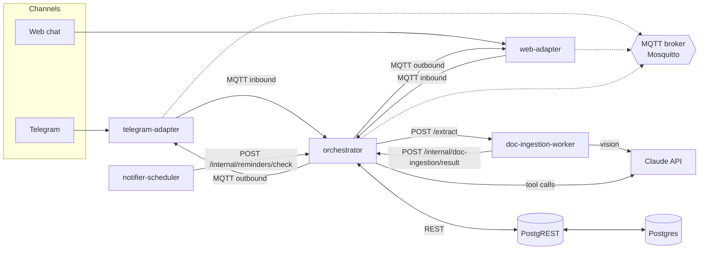

# 🏠 Home Assistant on Barbara

A conversational home assistant that lives on a [Barbara](https://barbara.tech) edge node. You talk to it over Telegram (or a plain web chat), and it helps you catalog your home devices, troubleshoot them, learn about stuff, and figure out what to buy next.

This started as a personal project, but it's built on Barbara — an industrial edge computing platform — on purpose: the same patterns here (event bus, JSONB-first schema, ISA95-style location hierarchy) are meant to scale later into an industrial knowledge-base use case (PLCs, SCADA, Historians). None of that industrial stuff is built yet — it's just why some design choices look a little more "enterprise" than a home project strictly needs.

[](./LICENSE)


---

## What it does

Talk to it like you'd talk to a knowledgeable housemate — send it text, a photo, a document, or a URL, in any combination, and it figures out what you mean:

- **Add a device** — snap a photo of a label or manual, it extracts brand/model/specs via Claude vision, shows you a draft, you confirm (or correct it inline), done.
- **Edit or document a device** — correct a detail on something already registered, or attach a manual/photo/note to it — Claude tells the two apart from context, not from a menu.
- **Troubleshoot** — ask about anything you've added ("why won't the washing machine drain?"), or just send a photo of the error code on the screen — it uses the device's saved specs plus a web search/fetch if needed, and walks you through a fix step by step.
- **Learn something** — ask for a quick course on any topic, get a short lesson plus a quiz to check you actually absorbed it.
- **Shop smart** — ask what to buy next (or what to replace something with), and it recommends options that are compatible with what you already have, with real prices/popularity pulled from the web.
- **Reminders** — ask to be reminded about anything (maintenance, a price check, a firmware check); it also delivers proactive nudges back through whichever channel you're on.

No canned menus, no keyword commands, no fixed "intent" categories. Claude decides everything itself by calling tools — orchestrator only executes what it's told. See [Design notes](#design-notes) below.

## Architecture



`orchestrator` is the only service with connections to MQTT, PostgREST, and (for the conversational flows) the Claude API — it's the single owner of every external/shared connection except the two named exceptions below. Everything else routes through it over a small internal HTTP API instead of touching those systems directly:

- **Channel adapters** (`telegram-adapter`, `web-adapter`) are the one deliberate exception on the inbound/outbound side: each manages its own Telegram/WebSocket connection *and* its own MQTT connection, publishing/subscribing directly to `home/inbound/<channel>/*` and `home/outbound/<channel>/*`. They're dumb translators — they turn whatever the channel gives them into a normalized message and publish it, and turn outbound normalized messages back into channel-native replies. The `orchestrator` never knows or cares which channel a message came from.
- **`doc-ingestion-worker`** is the other deliberate exception: it keeps its own Claude client for vision extraction (see [Design notes](#design-notes) for why), but has no MQTT or PostgREST connection at all — `orchestrator` calls its `POST /extract` directly, and it calls back to `orchestrator`'s `POST /internal/doc-ingestion/result` when done, since a vision extraction can take a while and shouldn't block the caller.
- **`notifier-scheduler`** has no MQTT or PostgREST connection either — it's reduced to a cron heartbeat that calls `orchestrator`'s `POST /internal/reminders/check` on a timer. It still exists as its own service because it owns something `orchestrator` doesn't: a Postgres-backed APScheduler jobstore, so scheduled ticks survive a restart independently of `orchestrator`'s process lifecycle.

Adding a new channel (WhatsApp, Slack, voice, whatever) is still just a matter of writing one more adapter that speaks the same MQTT contract — that part of the design is unchanged.

## Services

| Service | What it does | Notes |
|---|---|---|
| [`telegram-adapter`](./telegram-adapter) | Telegram ↔ normalized message | `aiogram` v3, long polling — no port exposed, no webhook/TLS to manage. Owns its own MQTT connection (exception #1) |
| [`web-adapter`](./web-adapter) | Minimal web chat ↔ normalized message | Always-on fallback channel — no Telegram account needed. The only service with an exposed port (8090). Owns its own MQTT connection (exception #2) |
| [`orchestrator`](./orchestrator) | The brain: runs Claude's tool-use agent loop on every message — no intent routing of its own | Stateless — conversation state (the Claude message transcript) lives in Postgres, not in the process, so it can scale to replicas. The only service connected to MQTT/PostgREST/Claude for everything that isn't one of the two exceptions above; exposes a small internal HTTP API for `doc-ingestion-worker` and `notifier-scheduler` |
| [`doc-ingestion-worker`](./doc-ingestion-worker) | Extracts device data from a photo via Claude vision, when Claude calls the `extract_device_data` tool | No MQTT, no PostgREST — called via `POST /extract`, calls back via `POST /internal/doc-ingestion/result`. Own bounded-concurrency queue so a slow extraction never blocks the chat flow. Keeps its own Claude client (the one narrow exception to full centralization — see Design notes) |
| [`notifier-scheduler`](./notifier-scheduler) | Cron heartbeat: pings `orchestrator` to check due reminders | No MQTT, no PostgREST — just `APScheduler` with a Postgres-backed jobstore (its one remaining reason to be a separate process) calling `POST /internal/reminders/check` |
| [`shared`](./shared) | Common library: message contract, MQTT/PostgREST clients, internal HTTP client, config/logging, structured Claude calls | Not a deployable service — a workspace package the others depend on |

## External services (not part of this repo)

Reused from Barbara's Marketplace instead of reimplemented — see the [Design notes](#design-notes):

| Service | Used for | Where it comes from |
|---|---|---|
| **Mosquitto** (MQTT broker) | The event bus every service talks over | Barbara Marketplace connector |
| **PostgreSQL** | All persistent data (devices, conversations, reminders) | Barbara Marketplace connector |
| **PostgREST** | Turns the Postgres schema into a REST API — no custom CRUD service | Barbara Marketplace connector |
| **Anthropic Claude API** | Everything: the tool-use agent loop, vision extraction, troubleshooting/course/replacement content, `web_search`/`web_fetch` | External API — you need your own key |
| **Telegram Bot API** | The Telegram channel | External API — you need your own bot token |

## Repo layout

Monorepo, `uv` workspace. One Python package per service, plus `shared`:

```
.
├── shared/                 # common library (all services depend on this)
├── telegram-adapter/
├── web-adapter/
├── orchestrator/
├── doc-ingestion-worker/
├── notifier-scheduler/
├── db/schema.sql           # Postgres DDL (schema `home`, served by PostgREST)
├── appconfigDev/           # local-only: appconfig.json (app-level) + global.json (device-level, unused today)
├── barbarasecrets.env      # local-only: every service's secrets, in one file
├── docker-compose.yml      # for the Barbara edge node — pulls pre-built images from Docker Hub, no build/secrets/appconfig here
├── docker-compose-local.yml # for local debugging — builds from source, mounting appconfigDev/ and barbarasecrets.env
├── Dockerfile.service      # one generic Dockerfile for all 5 services, parameterized via build args
├── build-and-push-images.sh # builds + tags + pushes all 5 images to Docker Hub — see below
└── pyproject.toml          # workspace root
```

Each service has its own `README.md` (linked in the table above) with its specific config, required secrets, and how to get credentials for whatever external API it needs.

## Configuration: one shared appconfig + one shared secrets file

This project follows Barbara's own conventions exactly — see the [`boilerplate_01_python`](https://github.com/Barbaraedge/training_barbara_apps_development/tree/main/boilerplate_01_python) reference project — rather than inventing a per-service scheme:

- **`appconfigDev/appconfig.json`** — ONE JSON file for the whole app, one top-level key per service (`orchestrator`, `telegram_adapter`, ...), mounted read-only at `/appconfig/appconfig.json` in every container. This is Barbara's "Appconfig Application Level".
- **`appconfigDev/global.json`** — Barbara's "Appconfig Device Level", mounted at `/appconfig/global.json`. Not consumed by any service yet (nothing here needs device-wide config today), included so the file exists and there's a `load_global_config()` helper in `shared/shared/settings.py` ready for whenever something does.
- **`barbarasecrets.env`** — ONE env file with every service's secrets, injected identically into every container via `env_file:` in `docker-compose-local.yml`. This matches how Barbara Secrets actually work on a real node: one store per app/project, not one per docker-compose service — a container just reads whichever variables it needs and ignores the rest.

On a real Barbara node (`docker-compose.yml`), the platform injects both of these the same way, at the same paths — nothing in this project's code needs to know or care whether it's running locally or deployed.

## Running it locally

You don't need a Barbara node to try this out — `docker-compose-local.yml` runs everything standalone, including a jobstore-only Postgres reachable at `postgresql`. You still need your **own** MQTT broker, Postgres+PostgREST, and API keys, since those aren't bundled (see the table above for exact requirements).

1. **Get the external pieces running.** Simplest path for local testing:
   - An MQTT broker reachable from your machine (e.g. `docker run -p 1883:1883 eclipse-mosquitto`).
   - A Postgres instance with `db/schema.sql` applied, and a PostgREST instance pointing at it (`PGRST_DB_SCHEMA=home`, `PGRST_DB_ANON_ROLE=app_service` — see [`db/schema.sql`](./db/schema.sql) for why there's no JWT here).
   - A Telegram bot token from [@BotFather](https://t.me/BotFather) (only needed if you want to test the Telegram channel — `web-adapter` needs nothing external).
   - An Anthropic API key from the [Anthropic Console](https://console.anthropic.com/).

2. **Fill in `barbarasecrets.env`** (repo root) with your real credentials — it ships with placeholders for every service's secrets in one file (see each service's README for which variables it actually reads). Never commit it with real values filled in.

3. **Build and run:**
   ```bash
   docker compose -f docker-compose-local.yml up --build
   ```

4. **Talk to it:**
   - Web chat: open `http://localhost:8090` in a browser.
   - Telegram: message your bot directly (it uses long polling, so no public URL or tunnel needed).

5. **Tweak config without rebuilding**: `appconfigDev/appconfig.json` (mounted read-only at `/appconfig/appconfig.json`) is watched and reloaded live — change any service's `debugLevel`, timeouts, or other settings and it picks it up within ~10s, no restart. `barbarasecrets.env` is the one thing that *does* need a restart to take effect (normal env var behavior).

If you're developing without Docker at all: it's a standard `uv` workspace, so `uv sync` at the repo root sets up every package, and `uv run python -m <package>.main` runs any one service directly (point `ANTHROPIC_API_KEY`/`MQTT_*`/whatever it needs at real values via env vars, and `/appconfig/appconfig.json` at a local copy of `appconfigDev/appconfig.json` if you want non-default settings).

## Deploying to a Barbara node

`docker-compose.yml` (the one Barbara actually uses) doesn't build anything — it pulls pre-built images from Docker Hub, one repository per service:

| Service | Docker Hub repository | URL |
|---|---|---|
| `telegram-adapter` | `kikeramirez/home-assistant-telegram-adapter` | https://hub.docker.com/r/kikeramirez/home-assistant-telegram-adapter |
| `web-adapter` | `kikeramirez/home-assistant-web-adapter` | https://hub.docker.com/r/kikeramirez/home-assistant-web-adapter |
| `orchestrator` | `kikeramirez/home-assistant-orchestrator` | https://hub.docker.com/r/kikeramirez/home-assistant-orchestrator |
| `doc-ingestion-worker` | `kikeramirez/home-assistant-doc-ingestion-worker` | https://hub.docker.com/r/kikeramirez/home-assistant-doc-ingestion-worker |
| `notifier-scheduler` | `kikeramirez/home-assistant-notifier-scheduler` | https://hub.docker.com/r/kikeramirez/home-assistant-notifier-scheduler |

`docker-compose-local.yml` is unaffected by any of this — it still builds straight from `Dockerfile.service` for local debugging, always with your latest local changes, never from Docker Hub.

### Publishing images to Docker Hub

`build-and-push-images.sh` (repo root) builds from `Dockerfile.service` — same one `docker-compose-local.yml` uses — and pushes to the 5 repositories above. Log in once per machine/session (always interactive, never scripted):

```bash
docker login
```

**All 5 at once** (the common case — e.g. after a change to `shared/`, which every service depends on):

```bash
./build-and-push-images.sh
```

**Just one or a few**, by service directory name — much faster when only that service changed:

```bash
./build-and-push-images.sh orchestrator
./build-and-push-images.sh orchestrator web-adapter    # a few, space-separated
```

Valid names: `telegram-adapter`, `web-adapter`, `orchestrator`, `doc-ingestion-worker`, `notifier-scheduler` (an unknown name fails fast with that list, instead of silently building nothing). Combine with either mode:

```bash
./build-and-push-images.sh --build-only                    # build all 5, push none — sanity-check first
./build-and-push-images.sh --build-only orchestrator        # same, but just one service
DOCKERHUB_USER=someoneelse TAG=0.1.0 ./build-and-push-images.sh orchestrator   # override account/tag too
```

The script never touches your credentials — it just checks you're already logged in and tells you to run `docker login` if a push gets rejected.

Once the images are pushed, deploying/updating on the Barbara node is just re-pulling: `docker compose -f docker-compose.yml pull && docker compose -f docker-compose.yml up -d` (or however Barbara's own deployment flow triggers a pull — check the platform's docs for the exact mechanism on your node).

## Design notes

A few decisions worth knowing about before you start reading code:

- **`orchestrator` owns every external/shared connection, with two named exceptions.** MQTT, PostgREST, and the Claude API (for the conversational flows) are only ever touched by `orchestrator`. The channel adapters (`telegram-adapter`, `web-adapter`) are the exception on the inbound/outbound side — each manages its own channel connection *and* its own MQTT connection, since they need to publish/subscribe on the bus directly as "external" services in their own right. `doc-ingestion-worker` and `notifier-scheduler` have no MQTT or PostgREST connection at all — they talk to `orchestrator` over a small internal HTTP API (`shared/shared/internal_client.py`'s `InternalApiClient`, a thin `httpx` wrapper with bounded retry — deliberately *not* retry-forever like the MQTT reconnect loop, since these are one-off calls tied to something happening right now, not a long-lived connection worth resurrecting indefinitely).
- **`doc-ingestion-worker` keeps its own Claude client — the one deliberate exception to full centralization.** Routing its vision-extraction call through `orchestrator` would mean `orchestrator` calls `doc-ingestion-worker` to extract → `doc-ingestion-worker` would have to call back into `orchestrator` just to reach Claude → `orchestrator` would need to relay the result back to `doc-ingestion-worker` again. That's a circular hop for no benefit, so `doc-ingestion-worker` keeps a narrow, direct `AsyncAnthropic` client of its own, purely for vision extraction — everything else about its connectivity (no MQTT, no PostgREST) still follows the centralization rule.
- **All Claude calls are async (`AsyncAnthropic`), not just fire-and-forget-friendly.** This matters more now than it used to: centralizing every conversational Claude call into one process (`orchestrator`) means a blocking synchronous call would stall every conversation in the house, not just one process's worth of work.
- **No hand-rolled intent detection — Claude drives everything via tool-use, orchestrator only executes.** There's no fixed set of flows and no branching on message type: every inbound message (text, an image, a document, a pasted URL, any combination) goes into one Claude tool-use agent loop (`shared.shared.claude.run_agent_loop`) with the tools in [`orchestrator/orchestrator/tools.py`](./orchestrator/orchestrator/tools.py) — `list_devices`, `create_device`, `update_device`, `attach_document`, `extract_device_data`, `schedule_reminder`, plus the built-in `web_search`/`web_fetch`. Claude decides which (if any) to call; content that's pure generation (a troubleshooting answer, a course, a replacement recommendation) is just its own final text, not a tool. A photo isn't automatically "a new device" — Claude looks at it and decides (label → onboard it; error code on a screen → troubleshoot; documentation for something you already have → attach it).
- **Conversation state is the Claude transcript itself.** `conversation.state.history` is the literal list of messages replayed each turn — quiz progress, corrections mid-onboarding, which device a "yes" refers to are all just Claude re-reading its own prior turns, not a hand-rolled state machine. The one exception is `extract_device_data` (vision extraction via `doc-ingestion-worker`), the sole *asynchronous* tool: calling it pauses the whole turn (no other tool in that batch runs, so a side-effecting call never executes only to be discarded) until the result comes back over the same internal HTTP callback described above.
- **Prompt caching and parallel tool execution aren't afterthoughts.** Every agent-loop call sets `cache_control` breakpoints on the system prompt (which also covers the tool schema list) and on the growing history; same-turn tool calls run concurrently and their results always come back in one combined message, never split across several (splitting measurably trains Claude to stop parallelizing).
- **No custom CRUD service.** Device/user/conversation data is served straight off Postgres by PostgREST — see [`db/schema.sql`](./db/schema.sql) for the schema and the `compatible_devices()` SQL function that powers the compatibility graph.
- **Nothing crashes on a connection hiccup.** Every service retries MQTT connections and missing credentials in a loop (with a configurable backoff) instead of exiting — see `shared/shared/mqtt_client.py` and `shared/shared/settings.py`.
- **`appconfig.json` hot-reloads, secrets don't.** Matches how Barbara's own connectors are configured — see any service's README for the exact split.
- **Single-tenant, single-household, no auth.** PostgREST runs a single service role with no JWT, and `web-adapter` has no login — this is a deliberate simplicity choice for a trusted home LAN, documented inline where it matters (and easy to revisit if this ever needs to serve more than one household).

## License

[MIT](./LICENSE) — do whatever you want with it.
